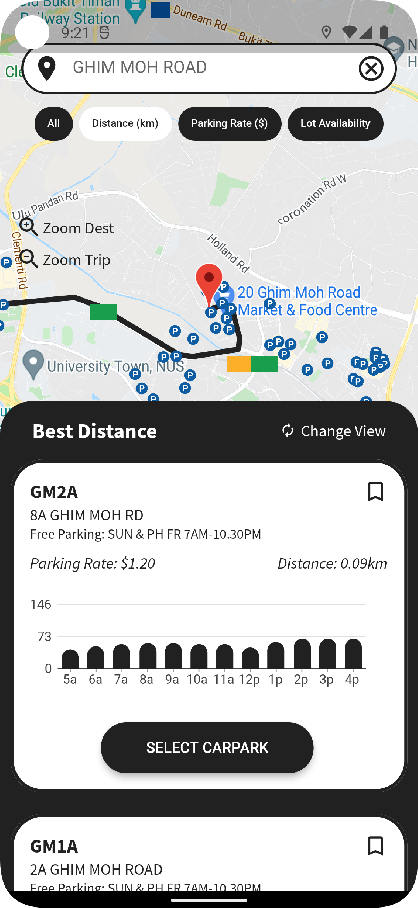

# ParkU@SG

Mobile application with integrated features for searching all HDB carparks islandwide to help users find the most suitable place to park their vehicle based on distance, price, availability.

### Built With

* Flutter
* Python
* Flask
* MySQL
* Firebase

## Getting Started

### Prerequisites

* Download the respective packages
* [Download Android Studio](https://developer.android.com/studio)
* [Download MySQL Workbench](https://dev.mysql.com/downloads/workbench/)
* [Setup a Firebase Account](https://firebase.google.com/)

### Installation

1. Download the repo
2. Open 'frontend' folder using Android Studio and run
3. Run 'backend' folder using Python script

## Preview

  
  
  

## Acknowledgments

In collaboration with
* [Mok Ying Chong](https://github.com/mokyingchong)
* [Rachanon Wachakorn](https://github.com/ped02)
* [Teo Guang Xiang](https://github.com/GxTeo)
* [Wang Sun Meng](https://github.com/wangsunmeng)
